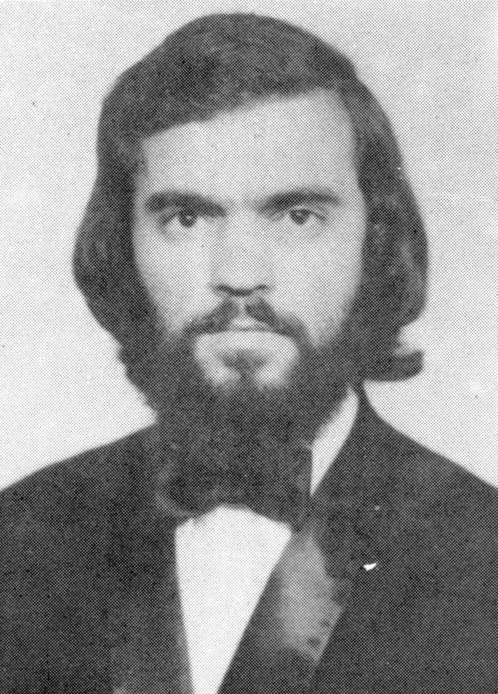

# Combinoteca

Ferramentas para buscas de resultados de loterias.

Atualmente implementado apenas para a [Mega-Sena](http://loterias.caixa.gov.br/wps/portal/loterias/landing/megasena/) como prova de conceito. Mas os princípios podem ser estendidos para qualquer loteria.


## Visão geral

O objetivo do projeto é criar um banco de dados com todos os concursos da Mega-Sena e fornecer uma ferramenta de busca instantânea aos resultados passados e suas combinações.

Usando um [sistema de numeração combinatorial](https://en.wikipedia.org/wiki/Combinatorial_number_system) é possível mapear cada possível resultado do concurso em um número sequencial único (_rank_).

Por exemplo: na Mega-sena, onde existem `C(60, 6)` = `50063860` possibilidades, a aposta `01 02 03 04 05 06` corresponde ao número `1`. Já a aposta `55 56 57 58 59 60` possui o _rank_ `50063860`.

Com esse mapeamento é possível trabalhar com os resultados e apostas de uma maneira compacta e eficiente.


## Pré-requisitos

  - Python 3.7 ou superior instalado


## Instalação

Execute (em um Bash ou Powershell):

```
python -m venv env
./env/Scripts/activate
pip install -r .\requirements.txt
```

Isso criará um ambiente virtual na pasta `env` e instalará os _packages_ necessários sem conflitos com a sua instalação Python default.


## Criando o banco de dados

Execute o script `DbBuild.py`.

```
python DbBuild.py
```

Esse script irá:
  - Fazer o download do arquivo com todos os resultados da Mega-Sena;
  - Descompactar o arquivo e extrair os dados relevantes do arquivo `html`;
  - Criar o banco de dados SQLite com os dados extraídos; e
  - Calcular as combinações de todas as quinas e quadras de todos os sorteios.

Ao final da operação o banco de dados terá um tamanho aproximado de 2Gb. Num Core i7-9700K o processo todo leva cerca de 20 minutos.


## Pesquisando resultados dos concursos

Execute o script `DbSearch.py` passando nos parâmetros os números da aposta a pesquisar:

```
python DbSearch.py 3 6 10 17 34 37
```

O script retornará (em formato `json`) todos os concursos que essa aposta teria sido premiada. No exemplo acima, o resultado mostra que essas foram as seis dezenas sorteadas no concurso 2000.

Também é possível pesquisar por uma aposta com mais de 6 números:

```
python DbSearch.py 3 6 10 17 34 37 43
```

Nesse caso, a busca retornará todas as possíveis combinações vencedoras. No exemplo acima, essa aposta de 7 dezenas teria acertado:

  - 1 sena no concurso 2000
  - 6 quinas no concurso 2000
  - 12 quadras nos concursos 435, 1078, 1245 e 1867 (3 quadras em cada concurso)

 
## Executando os testes

```
python -m unittest Combinatorics_test.py
```


## Exemplos de consultas

Alguns exemplos de consultas SQL:

```sql
-- Maiores quinas
SELECT Rank, D1, D2, D3, D4, D5, D6, COUNT(*) Quinas
FROM quinas
GROUP BY 1, 2, 3, 4, 5, 6, 7
HAVING COUNT(*) > 2
ORDER BY 8 DESC, 1
```

```sql
-- Maiores quadras (demora! Levou uns 10 minutos pra executar)
SELECT Rank, D1, D2, D3, D4, D5, D6, COUNT(*) Quadras
FROM quadras
GROUP BY 1, 2, 3, 4, 5, 6, 7
HAVING COUNT(*) > 8
ORDER BY 8 DESC, 1
```

```sql
-- Quinas x quadras
SELECT quinas.Rank, quinas.D1, quinas.D2, quinas.D3, quinas.D4, quinas.D5, quinas.D6, count(DISTINCT quinas.Concurso) Quinas, count(DISTINCT quadras.Concurso) Quadras
FROM quinas JOIN quadras ON (quadras.rank = quinas.rank)
GROUP BY 1
HAVING COUNT(DISTINCT quinas.Concurso) > 2
ORDER BY 8 DESC, 9 DESC
```


## Curiosidades

_Até o concurso 2130 (março de 2019)_

  - A aposta `17 29 38 49 50 53` já ganhou 10 quadras
  - A aposta `08 09 11 25 41 60` já ganhou 3 quinas e 5 quadras


## Agradecimentos

  - Prof. Neron Arruda Leonel (_in memorian_)



Os conceitos usados nesse projeto foram originalmente concebidos pelo Prof. Neron Arruda Leonel do [Instituto de Informática](http:////www.inf.ufrgs.br) da Universidade Federal do Rio Grande do Sul.
